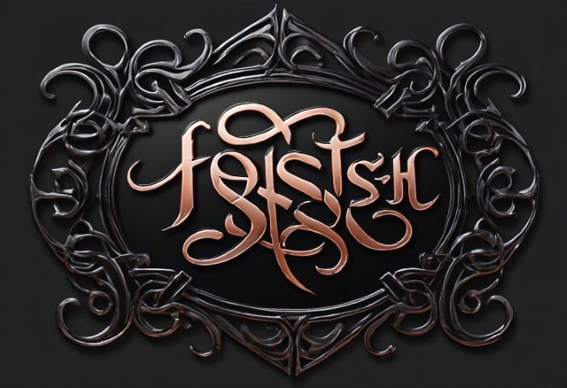

# darkreader



Simple SPA server for hosting text stories (in .txt files) and managing access using random passwords (no login).

## Development

### backend

Run backend:

`go run ./src`

If you want to use `secret` as your text directory, and you are on PowerShell and Windows like me:

`$env:TEXT_PATH = 'secret'; go run ./src`

Build binary:

`go build ./src`

### frontend

App uses Vite + React + Typescript for frontend

Run Vite dev server:

```sh
cd frontend
npm run dev
```

Frontend server uses proxy for API requests, so backend should be running and listening on port `6969`

# Build

## Use FAKE to build release (on Windows)

1. Install dotnet 6 SDK (**not the latest**)
2. Install fake: `dotnet tool install fake-cli -g`
3. Run fake: `fake run .\fakefile.fsx`

To run fake build on linux, targets for go cross-compilation should be changed

# Deploy

Currently I support only local deployment on any OS and Docker deployment on linux

## Run on linux

You can use Docker and Make to run it on your server on port 6969 (customizable in makefile)

1. Unzip release package and fix permission issues

```
unzip release.zip
```

2. Build docker image

```
make docker-build
```

3. Run docker image

```
make docker-run
```

4. Get the generated passwords, that are stored inside container

```
docker logs darkreader
```
